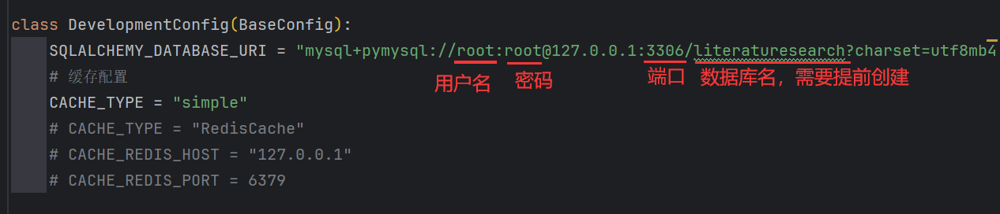
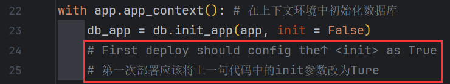

## 文献检索网站

### 介绍
本项目为“山东大学（威海）数据科学与人工智能实验班”大二上学期大作业，目的是为Web of Science网站上的Remots Sensing of Environment期刊建立文献检索和可视化的网站，辅助研究人员进行文献回顾、主题分类并迅速找到研究空白点。

### 项目架构
本网站基于python3.10开发，使用Flask架构、MySQL数据库，已成功部署在Ubuntu22.04轻型服务器上（外网访问），多设备测试均成功（本地访问）。

### 部署教程

1.  先安装Mysql数据库，完成后新建一个`literaturesearch`数据库；
2.  安装python3.10，使用`pip install -r requirement.txt`安装依赖库；
3.  进入`database.py`修改数据库用户名密码等配置：
    
4.  进入`app.py`修改数据初始化选项为`init = Ture`，等待写入数据库操作（约30s~2min）完成且开始运行flask应用后关闭flask，修改数据初始化选项为`init = False`：
    
5.  完成以上操作后就可以使用了，注意flask app在该项目中使用`host = 0.0.0.0`运行，如不需要外网访问可以删除该参数。

### 项目贡献者

刘宇昊：Flask搭建、服务器部署、项目测试、前端网页编写、MySQL脚本，说明文件等；

周洪田：前端网页设计、编写，项目测试等；

吴浏宇：MySQL数据库调用；

陈梓博：服务器搭建，前端网页调试；
