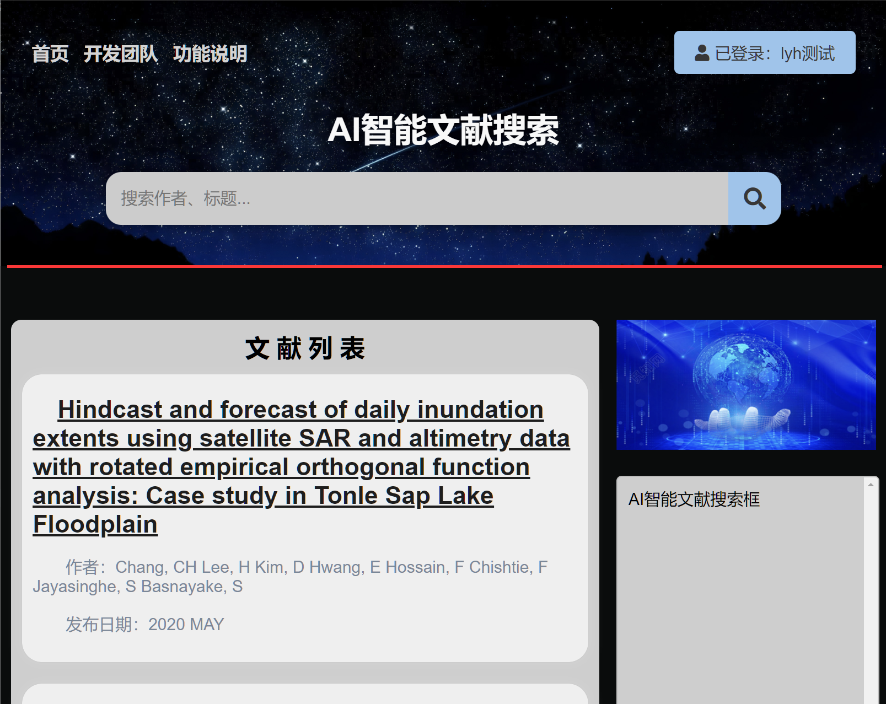
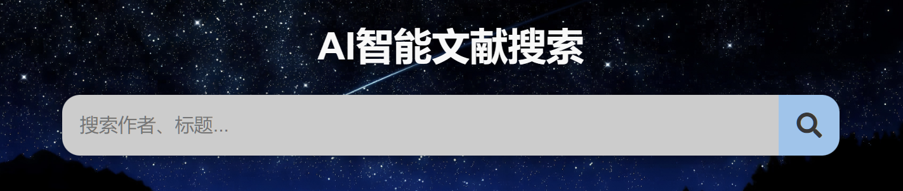
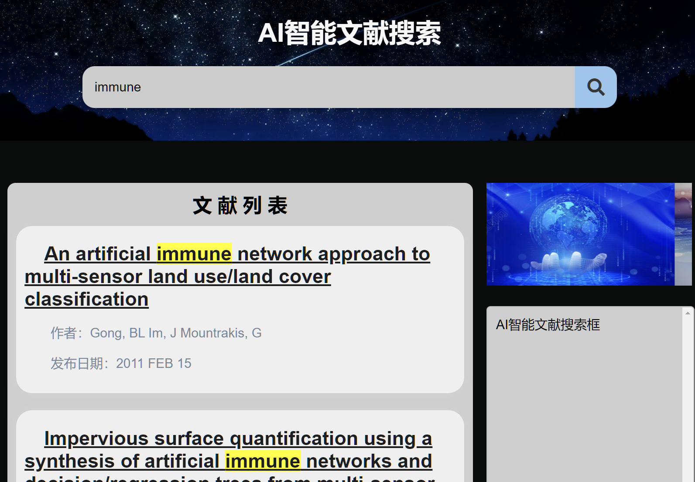
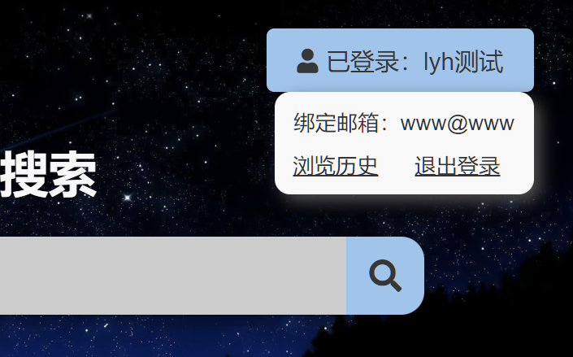

# 糖式组文献搜索网站帮助文档
[TOC]

## 1. 简介

本网站为“山东大学（威海）数据科学与人工智能实验班”大二上学期大作业，目的是为Web of Science网站上的Remots Sensing of Environment期刊建立文献检索和可视化的网站，辅助研究人员进行文献回顾、主题分类并迅速找到研究空白点。

该文档旨在介绍文献搜索网站的开发过程和使用方法，帮助用户更好地利用该平台进行文献检索。

##  2. 网站开发

### 2.1 技术栈

- 前端：HTML5, CSS, JavaScript, XHR
- 后端：Python, Flask框架, py-mysql
- 数据库：MySQL
- 主题模型：LDA, LSI
- 版本管理：Git, [Gitee仓库](https://gitee.com/Yiqian7a/literature-search-website)

### 2.2 开发流程

1. 搭建后端flask框架，实现用户注册登录、获取首页等简单功能；
2. 设计数据库结构，设计表单；设计前端基本界面；
3. 串联数据库前后端，实现网页与对应后端操作的一一对应；
4. 完善前后端，优化网页结构，提升性能；
5. 测试，确保网站稳定性和用户体验。
6. 

##  3. 网站使用

### 3.1 注册与登录
- 访问网站，如果未登入将跳转至登入界面。
- 点击“注册”按钮进行账号注册，已有账号的用户可以直接输入用户名和密码登录。

### 3.2 首页

#### 3.2.1 概况

页面分为上下两块部分（红线上下），上面的内容不会改变，每一个页面都有，下面的内容根据不同页面会有所改变。当进入主页时，将随机推荐5篇文献，点击标题即可查看详细信息。在页面内跳转后，再点击首页即可返回首页，继续查看刚才查看的文献。

#### 3.2.2 搜索

在上面的搜索框输入时，会在数据库中搜索，展示作者、标题中包含关键词的内容并高亮。

搜索结果如下，点击其中文献将跳转至该文献的详细信息：

#### 3.2.3 用户信息

鼠标移至右上角，将弹出小框显示用户绑定的邮箱，可以点击其中的链接跳转至用户历史记录。

### 3.3 历史记录

### 3.4 文献详情

### 3.5 页尾
